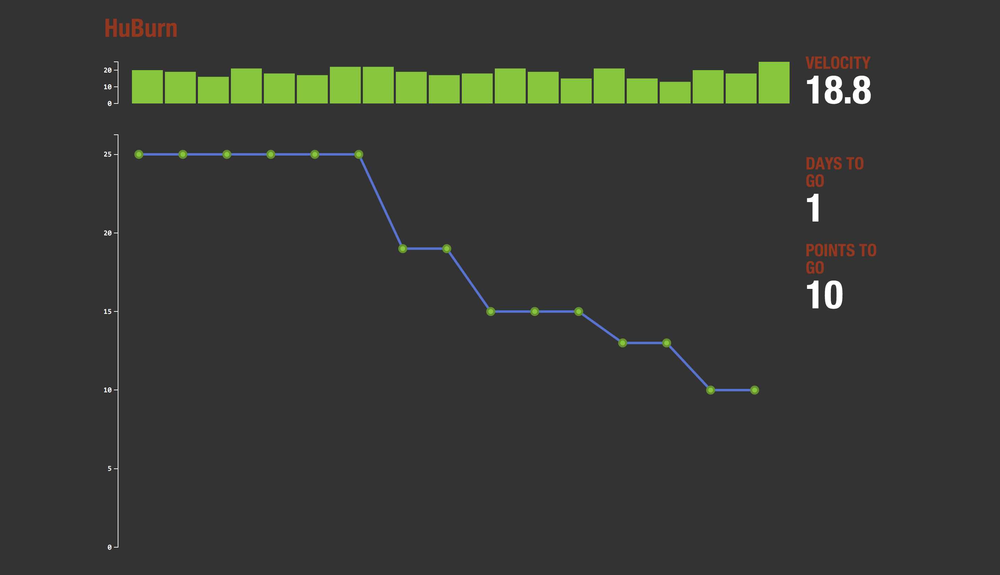

Velocity and Burndown chart for GitHub milestones.

Config
------

A configuration file named config.js is required for huburn to operate. 

```js
module.exports = {
  githubClientId: 'xxx', 
  githubClientSecret: 'xxxxxx',
  sslCaBundlePath: '/ssl.ca-bundle',  # Must exist, but can be empty when using self-signed
  sslKeyPath: '/ssl.key',
  sslCertPath: '/ssl.crt'
}
```

